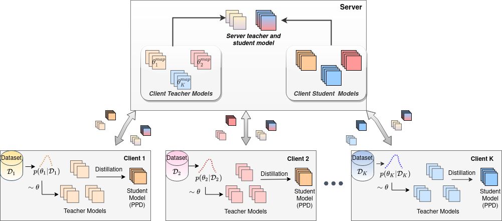

# Bayesian Federated Learning via Predictive Distribution Distillation

This repository provides code for FedPPD. 

FedPPD is a Bayesian federated learning algorithm in which every client learns predictive posterior distribution over its private dataset and share it with the server which aggregates them in varied  ways.





## Setup

- #### Requirements

  - Python 3.7

  - PyTorch 1.11.0

  - Torchvision 0.12.0

  - Cuda 10.2
  - Tensorboard 2.8.0

- #### Dataset

  - MNIST, CIFAR-10, and CIFAR-100 dataset will be downloaded and prepared in the code itself.

  - For FEMNIST dataset, use [Leaf benchmark](https://github.com/TalwalkarLab/leaf/)  to download it and run following command to generate train and test dataset.

    ```./preprocess.sh -s iid --iu 0.003 --sf 0.3 -t sample```

    For FedPPD with distillation based aggregation at server, manually split the files in train directory into two disjoint directories: **train** and **server_data** for performing distillation at server in *FedPPD+Distill*. *train* directory should have number of files equal to number of total clients. *server_data* should store very few (~4) files as unlabeled data on the server.

- #### Commands

  - To run FedPPD, execute following commands as per the dataset:

    ```
    python3 train_cifar_mnist.py --dataset mnist --rounds 100 --local_ep 10 --teach_lr 0.045 --teach_sch_gamma 0.85 --teach_sch_step 2 --stud_lr 0.055 --model cnn --log_dir log_fedppd_mnist --img_use_frac 0.08 --num_data 57500 --num_threads 5
    
    python3 train_cifar_mnist.py --dataset cifar10 --rounds 200 --local_ep 10 --teach_lr 0.055 --teach_sch_gamma 0.85 --teach_sch_step 3 --stud_lr 0.02 --model cnn --log_dir log_fedppd_cifar10 --img_use_frac 0.5 --num_data 40000 --num_threads 5
    
    python3 train_cifar_mnist.py --dataset cifar100 --rounds 200 --local_ep 10 --teach_lr 0.055 --teach_sch_gamma 0.85 --teach_sch_step 3 --stud_lr 0.02 --model resnet --log_dir log_fedppd_cifar100 --img_use_frac 0.5 --num_data 40000 --num_threads 5

    python3 train_femnist.py --dataset femnist --rounds 200 --local_ep 10 --teach_lr 0.05 --teach_sch_gamma 0.8 --teach_sch_step 3 --stud_lr 0.085 --model cnn --log_dir log_fedppd_femnist --num_threads 5 --femnist_data_dir <path/to/femnist/data> --subsample 2000

    ```

    

  - To run FedPPD with distillation at server, execute following commands as per the dataset:

    ```
    python3 train_cifar_mnist.py --dataset mnist --rounds 100 --local_ep 10 --teach_lr 0.045 --teach_sch_gamma 0.85 --teach_sch_step 2 --stud_lr 0.05 --distill --server_ep 20 --teacher_type SWAG --use_client --use_SWA --teach_server_lr 0.001 --stud_server_lr 0.001 --server_bs 64 --model cnn --log_dir log_fedppd_distill_mnist --img_use_frac 0.08 --num_data 57500 --num_threads 5
    
    python3 train_cifar_mnist.py --dataset cifar10 --rounds 200 --local_ep 10 --teach_lr 0.055 --teach_sch_gamma 0.85 --teach_sch_step 3 --stud_lr 0.02 --distill --server_ep 20 --teacher_type SWAG --use_client --use_SWA --teach_server_lr 0.0015 --stud_server_lr 0.0025 --model cnn --log_dir log_fedppd_distill_cifar10 --img_use_frac 0.5 --num_data 40000 --num_threads 5
    
    python3 train_cifar_mnist.py --dataset cifar100 --rounds 200 --local_ep 10 --teach_lr 0.055 --teach_sch_gamma 0.85 --teach_sch_step 3 --stud_lr 0.02 --distill --server_ep 20 --teacher_type SWAG --use_client --use_SWA --teach_server_lr 0.0015 --stud_server_lr 0.0025 --swag_stepsize 0.00001 --model resnet --log_dir log_fedppd_distill_cifar100 --img_use_frac 0.5 --num_data 40000 --num_threads 5

    python3 train_femnist.py --dataset femnist --rounds 200 --local_ep 10 --teach_lr 0.06 --teach_sch_gamma 0.85 --teach_sch_step 3 --stud_lr 0.085 --distill --server_ep 50 --teacher_type SWAG --use_client --use_SWA --num_sample_teacher 120 --teach_server_lr 0.001 --stud_server_lr 0.001 --model cnn --log_dir log_fedppd_distill_femnist --num_threads 5 --femnist_data_dir <path/to/femnist/data> --subsample 2000

    ```

  - To run the experiments in iid setting (currently supported over CIFAR-10 and CIFAR-100 datasets), add the flag `--iid` in the command.

- #### References

  This repository contains some code modules from:

  - [apd_public](https://github.com/wangkua1/apd_public)
  - [Bayesian-Neural-Networks](https://github.com/JavierAntoran/Bayesian-Neural-Networks)
  - [FedBE](https://github.com/hongyouc/FedBE)

